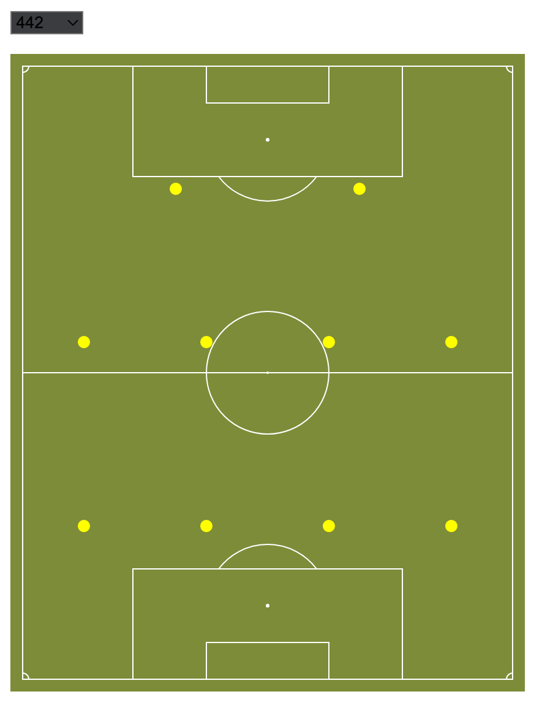
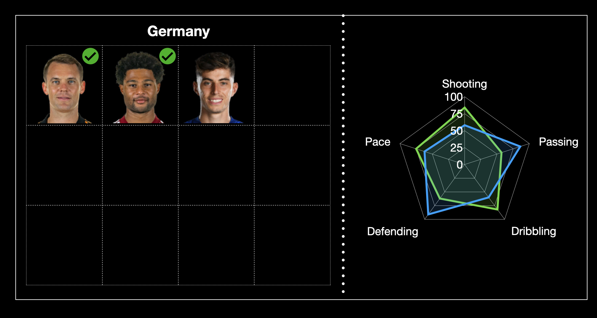

# Milestone 2

Our visualization aims at presenting the previous head-to-head records of the World Cup teams, the information of each team and each player in the context of upcoming 2022 World Cup. Besides, we are willing to tell you a story of Chinese football. You can follow the latest state of our website via [here](https://com-480-data-visualization.github.io/datavis-project-2022-y3/index.html) 

## Sketches of the final visualization
In our website, four separate tabs will be contained. The first _**Statistics**_ tab will be composed of 30 national football teams data. More specifically, the current status of each team, as well as each players data will be visualized here. Comparisons between different two teams are also provided, including their relationship among wins, draws and losses, the players abilities in the same position of their teams. The second tab “Story Telling” is designed to display the history of Chinese football, the current situation and our expectations for future. In addition, we provide you with _**Process Book**_ and _**About Us**_ sections to help you keep in touch with the progress of our project and our team member information.

In the first tab "Statistics", you will see the dark flags of 30 teams, and when your mouse hovers over the flags, the colors of the flags will lighten.

Fig1. Mouse hovering over Germany on the website

In "Statistics", when user clicks on a national flag,  it will scroll down to a section, with a football pitch on the left side of the section, which allows user to select different formations, whereas on the right side of the section is the historical match records of the selected team against other teams. On the football pitch, each yellow point represents a player, and we will upgrade yellow dots to 2D football jerseys containing player positions in Milestone 3.

Fig. 2 Football pitch with different formations in the real webpage

It will also show this team's player list below the pitch, and you can select two of the players to compare. The overall style is shown in Figure3, with the list of players on the left and a comparison chart of the players' abilities in various aspects on the right.

If you choose two teams, you will have two player lists. And you can choose two players from each team to compare like we show in Figure 4.

Fig. 3 Sketch of comparison of two players in the same team

Fig. 4 Sketch of comparison of two players from two different teams

In the section of player list, you can see their photos, ability value, position, jersey number and salary. The image below is the real effect we made in the website, it will replace the left part in the two sketches above.

Fig. 5 List of players information in the real webpage

## Tools used for each visualization

#### Website 

When building the website, we are using ***[Syntactically Awesome Style Sheet (SASS)]([Sass: Syntactically Awesome Style Sheets (sass-lang.com)](https://sass-lang.com/))*** as our CSS proprocessor, which contains richer features that do not exist in pure CSS, such as mixin, nesting selector, and so on. These features make the CSS structure more readable and easier to maintain. Beside, 

#### D3 Visualisation
- _**Country Selection Icon**_: user is able to select the corresponding team through 30 national icons provided in first page, which give access to the specific team information. 

- _**Team Formation Exhibition**_: one of the most important visualizations of our website is the exhibition of different team formations. D3 and JQuery are introduced to display different formations of selected team. By clicking the icon in different positions, the information of all players at that position will be displayed in a list.	

- _**Display of Statistical History Matches**_: the results history for nations competing in the world cup will be visualized in the favor of D3

- _**Players Abilities Radar Chart**_: d3 is used in this radar chart to compare players’ abilities in different evaluation dimensions. 

- _**Knowledge From Lectures**_: javascript is used to develop our website. D3 library is widely used in many aspects of our visualization, such as displaying team formation, player information and our story telling part. In addition, lecture: _Perception colors_ guides us to appropriately use colors for the designing of the website. Finally for the Story Telling section, we’ll use lecture: _Storytelling_ to help us.

## Independent pieces implementation

### Core visualization
The focus of our visualization is mainly on the first tab of our websites. In this part, 30 national team icons will be displayed for you to choose. After your selection, you will be directed to the corresponding information page of your selected team, where the specific team information will be shown, including the records against teams from other countries and team formations. You can select different formations of the team, and by clicking on the corresponding position, the player information on that position will also be displayed.

What’ more, during the process of displaying the specific team information, it’s possible for you to select the other country if you wish to compare these two teams. In this case, a comparative structure is developed to contrast the statistics of two teams. Two different lists of players from these two teams will be shown. After selecting two players from each team in the same position, the corresponding data of them will be visualized at the same time. 

### Extra ideas enhancing visualization
1.	A more complex version of results history for nations competing in the world cup with [expected effect]()(https://public.tableau.com/app/profile/simon.beaumont/viz/FIFAWorldCup-ResultsHistory/FIFAWorldCup-ResultsHistory)
2. An Hierarchical Edge Bundling shows the affiliation of each natioanl team's players with their clubs. The national team is in the middle and the clubs are on the left and right. Connect the national teams and clubs where players play for . This way we can clearly see which clubs each World Cup team's players come from.

## Functional project prototype review
Our cuurent websiote is able to view through the following link:
- [Y3 FIFA Visualization Website](https://com-480-data-visualization.github.io/datavis-project-2022-y3/index.html) 
